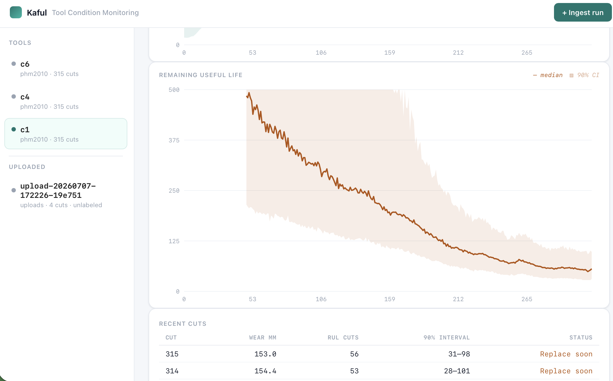

# Kaful — Streaming RUL Digital Twin for CNC Tools

Estimates the **remaining useful life (RUL)** of a CNC cutting tool, cut by cut,
from raw sensor waveforms — with a calibrated uncertainty interval on every
prediction — and serves it through a live tool-condition monitoring console.

Validated on the [PHM 2010 milling dataset](https://www.kaggle.com/datasets/rabahba/phm-data-challenge-2010)
(labeled tools c1/c4/c6).

<!-- Live demo: https://<your-service>.onrender.com -->
<!--  -->

## What it does

A CNC tool wears down as it cuts; once flank wear crosses ~0.2 mm the tool must be
replaced. You cannot measure that wear during operation without stopping the
machine — so Kaful **infers** it. For each completed cut it takes the raw force,
vibration, and acoustic-emission waveforms, estimates the tool's hidden wear state,
and projects how many cuts remain before failure, refreshing after every cut.

Wear is treated as a latent (hidden) variable recovered from sensor signals. Ground-
truth wear labels are used only to *score* the system, never to run it — matching the
reality that a deployed machine has no wear labels.

## How it works

### Pipeline

```
raw cut waveform (127k samples x 7 channels)
        │
        ├─► object storage (raw waveform kept immutable)
        │
        ▼
feature extraction ── 6 statistics x 7 channels = 42 scalar features
        │
        ▼
particle filter ── updates the hidden wear estimate from the new observation
        │
        ▼
Monte Carlo projection ── simulates each particle forward to the failure threshold
        │
        ▼
RUL distribution (median + 90% interval) ──► live monitor
```

### The models

**Degradation model** — how wear grows. Flank wear follows a power law
`dw/dn = a·wᵖ` (wear accelerates as the tool dulls). This is a Markov state model:
given the current wear, it predicts the next cut's wear. Parameters `(a, p)` are fit
from a reference tool's wear trajectory.

**Observation model** — how wear shows up in the sensors. Thrust force relates to
wear as `force = f0 + c·wᵏ`; `force_z_rms` is the strongest single wear indicator
(correlation ≈ 0.97 with measured wear). This maps a noisy force reading to a
likelihood over wear.

**Particle filter** — recovers the hidden wear. The wear estimate is carried as a
cloud of ~2000 weighted particles. Each cut: (1) *predict* — advance every particle
by the degradation model plus process noise; (2) *update* — reweight particles by how
well the observation model explains the new force reading; (3) *resample* — when the
effective sample size drops, resample to concentrate on likely values. The result is
a full posterior over current wear, not just a point estimate.

**Monte Carlo RUL** — turns wear into remaining life. The posterior particle cloud is
simulated *forward*, cut by cut with process noise, until each particle crosses the
0.2 mm threshold. The distribution of crossing times is the RUL distribution (median
+ 90% interval). Particles that don't fail within a horizon are *censored* and
reported as "not yet in wear-out" rather than a fake-precise number — so early in a
tool's life the system honestly says "no imminent failure" instead of inventing one.

**Calibration** — honest intervals. The filter's raw uncertainty was overconfident
(its 90% interval contained the truth only 46% of the time). Inflating the effective
observation noise widens the interval to reflect real model error; the wear-out
interval is calibrated to **90% coverage at no accuracy cost**.

## Results

Wear estimation scored against measured labels (non-circular):

- On its reference tool (c1), the filter recovers hidden wear to **6.3 µm RMSE in
  the wear-out regime**, with a **calibrated 90% confidence interval (coverage 0.90)**
  — where a single force reading alone is ambiguous to ±25 µm.

Deploying one tool's fitted model onto a *different* tool (scored against each tool's
own observed failure):

| model → tool | wear-out RMSE | 90% CI coverage | tool failed at |
|---|--:|--:|--:|
| c1 → c1 (self) | 6.3 µm | 0.90 | — |
| c1 → c4 | 23.2 µm | 0.16 | cut 313 |
| c1 → c6 | 33.5 µm | 0.00 | cut 291 |

Different tools wear on different schedules (c1's wear-out begins at cut 81; c4/c6 at
cuts 162/154), so a model with one tool's fixed degradation rate mistimes another's
wear-out. The system is accurate and calibrated in the wear-out regime of a tool it
has been fit to; per-tool rate adaptation is required to generalize across tools.

## The system

**API** (FastAPI):
- `POST /machines/{m}/runs/{r}/cuts` — ingest one cut (raw waveform bytes) → returns RUL.
- `GET  /machines/{m}/runs/{r}/rul` — the RUL time-series for a run.
- `GET  /machines/{m}/runs/{r}/replay` — Server-Sent-Events stream of the filter over a run (drives the live monitor).
- `POST /machines/{m}/runs` — tool change: end the active run, start a fresh one, deploy a new twin.
- `POST /analyze` — upload cut files → extract features → deploy the reference model → returns a run to monitor.
- `GET  /runs`, `GET /` — run list and the monitoring UI.

**Storage** — different data, different stores, behind interfaces:
- Features / labels / RUL / twin-state → SQLite (`DataStore` interface).
- Raw waveforms → object storage (`ObjectStore` interface): local filesystem, or any
  S3-compatible service (AWS S3 / Cloudflare R2 / Backblaze B2), selected by one env var.

**Run lifecycle** — a machine persists; tools come and go. Each tool installation is a
`Run` (wear starts at zero). A tool change ends the current run, archives it, and
deploys a fresh twin — so a tool swap is a clean reset, not a wear discontinuity.

**Monitor** — a live web console: a rail of tools, a health readout (Healthy →
Replace-soon → At-threshold, driven by live RUL), streaming wear + RUL charts with
confidence bands, and a per-cut feed. A model selector switches a tool between its own
fitted model and a reference model.

## Repo layout

```
domain/        dataclasses + abstract DataStore / ObjectStore interfaces
storage/       SQLiteDataStore, FilesystemObjectStore, S3ObjectStore (env-selected)
features/      FeatureExtractor (6 stats x 7 channels = 42 features)
datasets/      PHM 2010 adapter (waveform + wear-label loading)
ingest/        waveform codec, IngestHandler (orchestrates one cut), replay driver
twin/          degradation + observation models, particle cloud, filter, RUL, lifecycle
evaluation/    prognostic metrics (RMSE, coverage, alpha-lambda, prognostic horizon)
api/           FastAPI app + live monitoring UI (api/static/index.html)
scripts/       run_replay, load_labels, run_filter, validate, calibrate, serve, ...
tests/         pytest suite
```

## Running it

```bash
conda create -n kaful-data-twin python=3.11 -y && conda activate kaful-data-twin
pip install -e ".[dev]"
python -m pytest -q

ln -s ~/datasets/phm2010 data/phm2010          # PHM data (gitignored)

python scripts/run_replay.py --record c1        # ingest cuts (features + raw)
python scripts/load_labels.py --record c1       # load wear labels (scoring only)
python scripts/validate.py    --record c1                 # self-fit scorecard
python scripts/validate.py    --record c4 --reference c1  # cross-tool test
python scripts/serve.py                          # live monitor at http://127.0.0.1:8000
```

**Cloud object storage:** set `KAFUL_OBJECT_STORE=s3`, `KAFUL_S3_BUCKET`,
`KAFUL_S3_ENDPOINT_URL` (omit for native AWS), and standard AWS credentials.

## Tech stack

Python 3.11 · NumPy / SciPy (particle filter, model fitting, Monte Carlo) · SQLite ·
boto3 (S3-compatible object storage) · FastAPI + Uvicorn (HTTP + SSE) · pytest.
